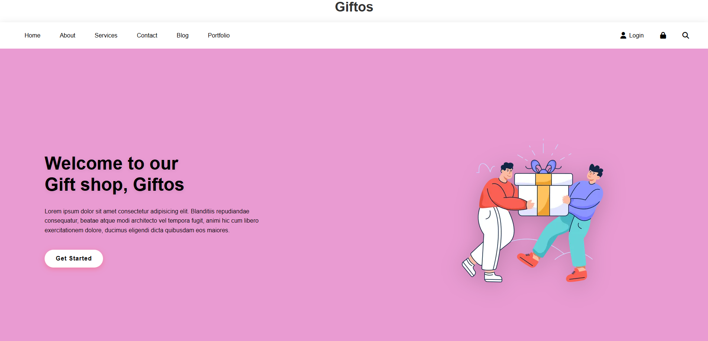

# Giftos - Gift Shop Website

A modern and responsive gift shop website built with HTML and CSS, featuring a clean design and smooth user interface.

## 🎨 Preview

## ✨ Features

- **Modern Design**: Clean and contemporary UI with beautiful color scheme
- **Responsive Layout**: Optimized for different screen sizes
- **Smooth Navigation**: Glass-morphism navbar with backdrop blur effects
- **Interactive Elements**: Hover effects and smooth transitions
- **Professional Typography**: Well-structured content with proper spacing

## 🚀 Technologies Used

- HTML5
- CSS3
- Font Awesome Icons

## 🎯 Key Design Elements

- **Color Palette**: Pink gradient background with white navigation
- **Typography**: Arial font family with modern spacing
- **Layout**: Flexbox-based responsive design
- **Effects**: Backdrop filters and smooth transitions

## 🛠️ Getting Started

1. Clone or download this repository
2. Open `index.html` in your web browser
3. Enjoy exploring the gift shop website!

## 🎨 Customization

You can easily customize the website by modifying:
- Colors in `style.css`
- Content in `index.html`
- Images and assets

## 📝 License

This project is open source and available under the [MIT License](LICENSE).

## 👤 Author

**Your Name**
- GitHub: [@prakshil](https://github.com/prakshil)

---

⭐ Star this repository if you found it helpful!
